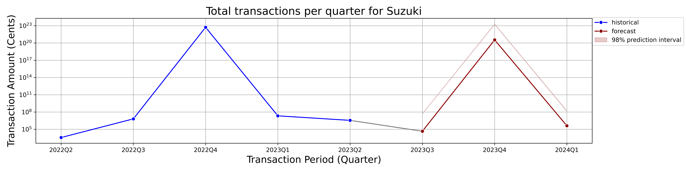

# CLO Forcast

## Overview
 The primary goal is to forecast the top 3 best-performing merchants for Q1 2024 and provide a clear data visualization of the results.

"Using python from a database that you build from this data, forecast the top 3 best performing merchants for Q1 2024."

I intepreted the above statement in two ways:

1. What is the forecast for our current top 3 merchants in 2024Q1?
- In this case, our top 3 merchants till date will be identified and their respective transaction amount will be forecasted.

2. Who will be our top 3 merchants in 2024Q1?
- In this case, the transaction amount for all the merchants will be forecasted for 2024Q1, and the merchants with the top 3 transaction amount will be identified.

The above statement is slightly ambigious, so I decided to provide answers using both interpretations.

## Data Sources
- kard_transactions.csv: Contains kard transaction data from issuers.
- external_transactions.csv: Contains third-party transaction data.
mapping.csv: Maps the data fields from Kard to the external data.

## Approach

### Exploratory data analysis (EDA)
EDA was performed mainly using ydata_profiling python library. ydata_profiling helps provide a holistic view of our data in form of detailed reports with stats and visualizations.

From the EDA report, the following were found:

 #### kard_transactions:
- Data contained 25 missing values in the 'merchant column'. This accounts for 2.5% of the merchant column & 0.4% of the entire dataset. The missing values also appears random with no pattern to it.
- 'transactionAmountinCents' column had 2 negative values (0.2% of the column).
- 'transactionDate' is in a JSON format.

 #### external_transactions:
- 'Date' column is in a string format, containing '$'.
- Data contain an invalid date in 2025
- 'Date' and 'Hour' column can be merged together and converted to datetime 

### Data Preparation
Data from the various sources were cleaned before being merged together using the maps provided in the mapping data (bottom-up approach). This includes addressing missing values, handling erroneous data, parsing dates e.t.c.

Summary of the cleaning process for each of the dataset:

kard_transactions:
- Missing values were dropped. 2.5% is a relatively small amount and can be dropped. Alternatively, any form of data imputation would introduce bias into the data since there are 63 unique merchants and only 25 missing values.
- The negative values seems to be most likely entry errors rather than refunds. They were assumed to be entry errors given our context and they were corrected to reflect their absolute values.
- Date in the JSON format were parsed and converted to datetime.

 external_transactions:
 -  2025 Invalid date was dropped. 
 - 'Date' and 'Hour' columns were properly formatted, merged and converted to datetime
 - IssuerId column was created and imputed with 31

#### Benefit, drawbacks and scalability of current data handling approach:
My approach of handling negative transaction amounts, removing records with invalid dates, and missing merchant names ensured high data quality and consistency, which is crucial for accurate analysis. However, this method also led to the loss of information (although just ~2.5%). As the dataset scales to billions of transactions, the manual and simplistic nature of this approach becomes less feasible. Scaling up would require advanced, real-time anomaly detection, automated data cleaning techniques and infrastructure, capable of efficiently handling large volumes of data while preserving as much valuable information as possible and minimizing bias.

#### Merging Data: 
Combined the Kard and external transaction datasets using a mapping file. The Kard columns were maintained for the combined data.

# First interpretation:
1. What is the forecast for our current top 3 merchants in 2024Q1?
- In this case, our top 3 merchants till date will be identified and their respective transaction amount will be forecasted.

### Analysis
- Perfomed Analysis to determine the top 3 merchants,  which were Suzuki, Ford, and Chevrolet
- Further prepared the dataset for forcast modeling with sktime. This included converting the dates to quarters and also imputting the sum of all transaction per merchant for each quater.

### Forecasting 
A grid search over 8 different top forcast models (AutoArima, prophet, STLforcaster, NaiveForcaster, Xgboost, Bats, AutoETS, ExponetialSmoothing) and various transformers (Deseasonalizers, detrenders, e.t.c) was performed to determine the best model/pipeline that captures the data. From the grid search the best model/pipeline was:

Overall, my forecast model selection was purely data driven.

### Result

The forecast plots were seperated for clarity as shown above. 
For 2024Q1, the forecast for the top 3 performing merchants are:
- Suzuki: 405252.3 cents ~ $4052.52
- Ford: 253802200 cents ~ $2,538,022
- Chevrolet: 122812900 cents ~ $1,228,129

From the plot:

Ford is anticipated to lead  with an estimated $2,538,022. The forcast shows a stable trend, and despite the wide 98% prediction interval. The Q3 2023 validation is at the edge of the prediction interval, indicating some accuracy

Chevrolet follows with a forecast of $1,228,129. Similar to Ford, the prediction interval is broad, yet the forcast suggests that Chevrolet will continue to attract substantial transaction volumes into the next year. The actual value for 2023Q3 falling within this interval suggests that the model has some level of accuracy in its forecasts.

Suzuki shows a  forecast of $4,052.52. The forecast displays a sharp peak, which then returns back to the mean, indicating a possible one-off event. The prediction interval is narrower, indicating a higher confidence in the forecast but on a smaller scale.

### Recommendation
- Strengthen partnerships with top merchants.
- Increase Issuer Participation: 
Encourage more issuers to participate in the CLO program with these merchants, especially in demographics or regions that align with the forecasted growth.

# Second interpretation:
2. Who will be our top 3 merchants in 2024Q1?
- In this case, the transaction amount for all the merchants will be forecasted for 2024Q1, and the merchants with the top 3 forecasted transaction amount will be identified.

### Forecasting 
The same model/pipleine used above, was also used here.

### Result

(I didn't have enough time to include the prediction intervals and also provide a validation. I only just returned from my thanksgiving holiday and wanted to submit this ASAP)

From the plot:

Oldsmobile takes the lead for 2024Q1 with a projected 4007415000 cents ~ $40,074,150.  There's fluctuation in transaction amount, hinting at potential seasonality or market-specific events. 
- Specific recommendation:This warrants a deeper dive into Oldsmobile's transaction drivers to tailor our engagement and promotional efforts effectively.

Mercedes-Benz: Our analysis predicts a maintenance of current transaction levels, with no significant increase or decrease. 
- Specific recommendation: This stability offers a reliable platform for consistent marketing strategies, and we should continue to monitor this trend closely.

Ford: The forecast indicates a stable trend. This continuity signals could suggest a robust consumer trust/ loyalty.

### Recommendation
- Strengthen partnerships with top merchants.
- Increase Issuer Participation: 
Encourage more issuers to participate in the CLO program with these merchants, especially in demographics or regions that align with the forecasted growth.